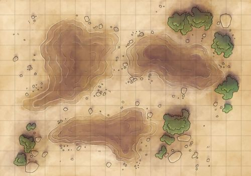
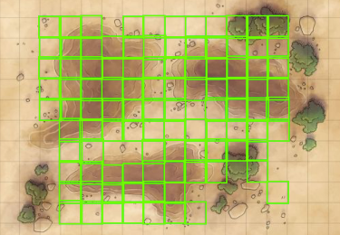

# FantasyMaps

**tl;dr:** Machine learning model for generating VTT-compliant JSON from map
images.

If you've ever downloaded a map file from the internet for your virtual
role-playing session, you know the pain of identifying and quantifying gridlines
by hand.

The goal of the Fantasy Maps project is to create a machine learning model that
can identify gridlines on a map for you. Ultimately, the resulting model will
be available for use as a C library, or even integrated into mobile and web
applications for easy use!

## Give us your maps!

In machine learning, your model is only as good as the quality and quantity of
the data used to train it. To create a better model, you must provide more
high-quality data.

This is where you come in: we need more training data! We accept computer-drawn
maps with gridlines overlayed on top. Although we will accept just maps, we
would really appreciate any VTT-compliant JSON metadata that goes along with the
maps.

We accept PNG and JPG images.

## Progress

The Fantasy Maps project uses [Vertex AI][vertex], the flagship machine-learning
platform from Google Cloud. Using Vertex AI, we are training
[AutoML object detection][od] models to identify the gridlines on a map.
The first step in training our model(s) are to create online prediction models
to prove that the Fantasy Maps concept works.  Ultimately, we will export the
Vertex AI model(s) into a compact form that can be distributed along with a C
library.

### Current Status

We have successfully created an online model that identifies gridlines!

Original image:

Predicted gridlines (output from model):

Our next step is to create an exportable version of this model to incorporate
into a library. We need more training data to create a high-quality, exportable
model.

<!-- LINKS -->
[od]: https://cloud.google.com/vertex-ai/docs/beginner/beginners-guide?hl=en#video
[pipe]: https://cloud.google.com/vertex-ai/docs/pipelines/introduction?hl=en
[vertex]: https://cloud.google.com/vertex-ai
